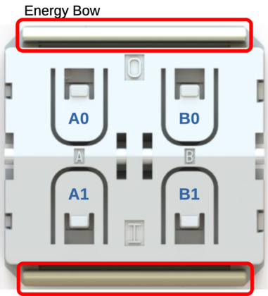

# EnOcean BLE (PTM 215B/PTM 216B) for Home Assistant

`enocean_ble` is a Home Assistant custom integration for EnOcean BLE
energy-harvesting switches (PTM 215B/PTM 216B).

It provides:
- Bluetooth discovery + guided commissioning flow
- Secure telegram parsing (MIC verification)
- Button events as native Home Assistant `event` entities

## Supported Devices

- EnOcean PTM 215B
- EnOcean PTM 216B

## Installation

### HACS (recommended)
1. HACS -> `Integrations` -> `...` -> `Custom repositories`
2. Add this repository URL, category: `Integration`
3. Install `EnOcean BLE`
4. Restart Home Assistant

### Manual
1. Copy [`custom_components/enocean_ble`](custom_components/enocean_ble) to your HA `custom_components` directory
2. Restart Home Assistant
3. Settings -> Devices & Services -> `Add Integration` -> `EnOcean BLE`

## Add Your Device

1. Click `Add` when the switch appears in Bluetooth discovery.
2. Follow the sequence on button 1:
   - hold for about 7 seconds,
   - press briefly,
   - hold again for about 7 seconds.
3. When the confirmation screen appears, press another button (not button 1) to exit commissioning mode.
4. Click `Submit`.

Notes:
- If the switch is already in commissioning mode, progress can complete almost immediately.
- After success, press another button to ensure the switch exits commissioning mode.

## Events

The integration creates 4 event entities: `A0`, `A1`, `B0`, `B1`.

Event type values:
- `press`
- `release`
- `long_press`
- `long_release`

Event data includes:
- `mac_address`
- `rssi`
- `sequence_counter`

## Usage Examples

Example 1: Toggle a light on `A0` trigger.

```yaml
alias: EnOcean A0 - Toggle Living Room
mode: single
triggers:
  - trigger: state
    entity_id: event.e2_15_00_xx_xx_xx_button_a0
actions:
  - action: light.toggle
    target:
      entity_id: light.living_room
```

Example 2: Activate an "Away" scene on `A1` trigger.

```yaml
alias: EnOcean A1 - Away Scene
mode: single
triggers:
  - trigger: state
    entity_id: event.e2_15_00_xx_xx_xx_button_a1
actions:
  - action: scene.turn_on
    target:
      entity_id: scene.away
```

Example 3: Use `B0` and `B1` for dim up/down.

```yaml
alias: EnOcean B0/B1 - Dimming
mode: restart
triggers:
  - trigger: state
    entity_id: event.e2_15_00_xx_xx_xx_button_b0
    id: b0
  - trigger: state
    entity_id: event.e2_15_00_xx_xx_xx_button_b1
    id: b1
actions:
  - choose:
      - conditions:
          - condition: trigger
            id: b0
        sequence:
          - action: light.turn_on
            target:
              entity_id: light.living_room
            data:
              brightness_step_pct: 20
      - conditions:
          - condition: trigger
            id: b1
        sequence:
          - action: light.turn_on
            target:
              entity_id: light.living_room
            data:
              brightness_step_pct: -20
```

## Troubleshooting

- Device re-adds immediately after deletion:
  the switch is likely still in commissioning mode and keeps sending `LEN=26`.
- No button events:
  verify BLE reception and that commissioning completed successfully.
- Auto-commissioning sequence never works:
  device may have commissioning mode disabled by prior configuration; try factory reset.
- Intermittent events:
  check distance/RSSI/interference.
- Occasional missed press:
  can happen on 2.4 GHz BLE in real environments (interference, attenuation, collisions). This is inherent to radio communication and not always a software defect.

## Migration / Factory Reset

If the switch has been used in another ecosystem, commissioning in Home Assistant can fail if active key/settings no longer match what you expect.

> [!WARNING]
> Disclaimer (OEM setups): some manufacturers/integrators can customize commissioning and radio behavior via NFC (for example commissioning mode behavior, addressing/security parameters, or other module settings).
> A factory reset restores EnOcean default module settings.
> After reset, re-joining the original OEM ecosystem may require re-provisioning, and in some setups it may no longer be possible without OEM tools/process.

> [!WARNING]
> If auto-commissioning never starts (or never yields a commissioning telegram), the device may have radio commissioning disabled by prior NFC/OEM configuration.

In that case, perform a factory reset on the switch module:
1. Remove rocker and housing to access module contacts.
2. Press `A0 + A1 + B0 + B1` together.
3. While holding those contacts, press the energy bow.
4. Keep the energy bow pressed for at least 10 seconds.
5. Release and retry commissioning.



Practical tip:
- This is physically tricky. A common trick is to hold the 4 contacts with one hand (or a small non-conductive tool) and press/hold the energy bow with the other hand.

## Compatibility

Tested with:
- Feller EDIZIOdue BLE Switch (user-tested in this project)

Compatibility assumption:
- In general, PTM 215B/PTM 216B-based BLE switches should work with this integration.
- However, compatibility is not mathematically guaranteed if product NFC/BLE settings were customized.

Important:
- Not every product labeled "EnOcean" is BLE.
- This integration targets BLE telegrams in the 2.4 GHz band from PTM 215B/PTM 216B family devices.
- Sub-GHz EnOcean products (e.g. 868/902 MHz) are out of scope for this integration.

### Wall switches integrating EnOcean PTM 215B or PTM 216B

**Twelve distinct switch models from ten manufacturers** are confirmed to integrate EnOcean's BLE energy-harvesting modules PTM 215B or PTM 216B. The PTM 215B (launched ~2018) is now marked "not recommended for new designs" and is being superseded by the PTM 216B (announced January 2024), which offers doubled radio transmission power via the newer ECO 260 harvester. Both modules share the same 40×40×11.2 mm form factor, enabling drop-in replacement. Most major European switch brands (Gira, Jung, Berker, Merten) do **not** manufacture their own PTM 215B/216B switch products — they only supply compatible decorative frames for EnOcean's own Easyfit switches.

#### Confirmed products with explicit module identification

Every product below has the PTM 215B or PTM 216B **explicitly named** in official manufacturer documentation, datasheets, installer manuals, or authoritative EnOcean partner pages.

| Manufacturer | Model | Module(s) | Datasheet / User Guide |
|---|---|---|---|
| EnOcean (Germany) | EWSSB — Easyfit Single Rocker Wall Switch, EU 55 mm | PTM 215B (older rev) / PTM 216B (rev DD) | [EWSxB Datasheet (PDF)](https://www.enocean.com/wp-content/uploads/downloads-produkte/en/products/enocean_modules_24ghz_ble/easyfit-single-double-rocker-wall-switch-for-ble-ewssb-ewsdb/data-sheet-pdf/EWSxB_Datasheet.pdf) · [User Manual rev DD (PDF)](https://www.enocean.com/wp-content/uploads/downloads-produkte/en/products/enocean_modules_24ghz_ble/easyfit-single-double-rocker-wall-switch-for-ble-ewssb-ewsdb/user-manual-pdf/EWSxB_DD_User_Manual.pdf) |
| EnOcean (Germany) | EWSDB — Easyfit Double Rocker Wall Switch, EU 55 mm | PTM 215B (older rev) / PTM 216B (rev DD) | Same as EWSSB above |
| EnOcean (Germany) | ESRPB — Easyfit Single Rocker Pad, US Decora style | PTM 216B | [Product page](https://www.enocean.com/en/product/easyfit-single-double-rocker-pad-for-ble-esrpb-edrpb/) |
| EnOcean (Germany) | EDRPB — Easyfit Double Rocker Pad, US Decora style | PTM 216B | Same as ESRPB above |
| Feller (Switzerland) | 4122.1.S.F — EDIZIOdue BLE Funktaster, single rocker, 2-channel | PTM 215B | [Online catalog](https://online-katalog.feller.ch/kat_details.php?fnr=4122.1.S.F.67) |
| Feller (Switzerland) | 4122.2.S.F — EDIZIOdue BLE Funktaster, double rocker, 4-channel | PTM 215B | [Online catalog](https://online-katalog.feller.ch/kat_details.php?fnr=4122.2.S.FMI.67) |
| Eltako (Germany) | FTE215BLE — Wireless pushbutton insert, BLE | PTM 215B | [Datasheet (PDF)](https://www.eltako.com/fileadmin/downloads/en/_datasheets/Datasheet_FTE.pdf) · [Product page](https://www.eltako.com/en/product/professional-standard-en/accessories-professional-standard/fte215ble/) |
| Vimar (Italy) | 03925 — Bluetooth Low Energy RF 4-button device | PTM 215B | [Installer manual (PDF)](https://www.vimar.com/irj/go/km/docs/z_catalogo/DOCUMENT/03925IEN.80268.pdf) · [Product page](https://www.vimar.com/en/int/catalog/product/index/code/03925) |
| Hytronik (China) | HBES01 — Wireless BLE kinetic wall switch, EU 55 mm | PTM 215B | [Datasheet (PDF)](https://hytronik.com/system-level-components/switch-enocean-hbes01-b/switch-enocean-hbes01-b.pdf) · [Product page](https://hytronik.com/product/switch-enocean-hbes01-b) |
| AIMOTION (Germany) | Switch 55 (1051xx / 1052xx) — Casambi BLE wall switch | PTM 216B | [Datasheet (PDF)](https://casambi-aimotion.de/wp-content/uploads/2025/03/AIMOTION_1051_1052_Casambi_EnOcean_Switch_55_v.3.7.pdf) · [Product page](https://casambi-aimotion.de/en/produkt/switch-55-white/) |
| Niko (Belgium) | Dimmer switch, Bluetooth® — wireless dimmer rocker | PTM 216B | [Niko product page](https://www.niko.eu/en/products/wireless-controls/niko-dimmer-switch-enocean-productmodel-niko-785fb59a-c90e-5349-a30b-35fc36009b20) · [EnOcean partner page](https://www.enocean.com/en/batteryfree/niko-dimmer-switch-bluetooth/) |
| Kopp (Germany) | Blue-control Wandschaltermodul (867001011) — BT Mesh wall switch | PTM 215B | [Product page](https://produkte.kopp.eu/de/produkt/blue-control-energieautarkes-bluetooth-wandschaltermodul-mit-montagerahmen-2/) |

#### Products with strong indirect evidence but no explicit module naming

These switches use BLE 2.4 GHz energy harvesting with NFC and AES-128 — technology exclusive to the PTM 215B/216B — but their manufacturers do not publicly name the internal EnOcean module in accessible documentation.

| Manufacturer | Model | Likely Module | Datasheet / User Guide |
|---|---|---|---|
| Busch-Jaeger / ABB (Germany) | 6716 UBT — BLE Smart Switch insert | PTM 215B (all specs match; released 2022, before PTM 216B existed) | [Product page](https://www.busch-jaeger.de/en/online-catalogue/detail/2CKA006710A0015) · [Product manual (PDF)](https://www.busch-jaeger.de/files/files_ONLINE/BLE_Smart%20Switch_BJE_DE_18.08.2022.pdf) |
| Häfele (Germany) | 850.00.025 — BLE Single Rocker Wall Switch, US Decora | PTM 215B (FCC filing references PTM 215B user manual) | [Product page](https://www.hafele.com/us/en/product/wall-switch-ble-single-rocker-white-usa/85000025/) |
| Häfele (Germany) | 850.00.940 / 850.00.944 — Battery-Free Wireless Wall Switch, US Decora (replaces 850.00.025/026) | PTM 215B or PTM 216B | [Product page (double)](https://www.hafele.com/us/en/product/double-rocker-kinetic-wall-switch-bluetooth-battery-free-wireless-connect-mesh/P-01956566/) |
| Retrotouch (UK) | Crystal EnOcean Smart Switch (02623 BLE variant) — glass rocker, 86 mm | PTM 215B or PTM 216B (EnOcean-certified partner) | [Manufacturer page](https://www.retrotouch.co.uk/enocean-wireless-kinetic-switches.html) · [EnOcean partner page](https://www.enocean.com/en/battery-free-products/retrotouch/) |
| Tunto (Finland) | Wireless Tunto Switch — designer BLE rocker | PTM 215B (transmit power 0.4 dBm matches PTM 215B spec exactly) | [Product page](https://www.tunto.com/product-page/enocean-switch) · [Casambi listing](https://casambi.com/ecosystem/tunto-enocean-switch/) |

#### Why so few products exist for these specific modules

The relatively short list reflects a critical distinction many buyers overlook. **The PTM 215B and PTM 216B are the BLE (Bluetooth Low Energy, 2.4 GHz) variants** of EnOcean's pushbutton transmitter module family. The vast majority of EnOcean-branded wall switches on the market — from well-known brands like Theben, NodOn, Peha, and Thermokon — use the **sub-1 GHz PTM 210 or PTM 215** (868/902 MHz EnOcean radio protocol) or the **PTM 215Z/216Z** (Zigbee Green Power). These are entirely different radio standards despite sharing the same physical form factor. Several "Friends of Hue" switches (from Senic, Gira, Jung, Berker) use PTM 215Z/215ZE for Zigbee Green Power, not BLE.

Major European switch brands like **Gira, Jung, Berker/Hager, and Merten/Schneider Electric** do not manufacture their own PTM 215B/216B switch inserts. Instead, their 55 mm decorative frames are compatible with EnOcean's own Easyfit EWSSB/EWSDB products. Similarly, brands like **Siemens, Legrand, Eaton, and WAGO** were searched extensively and have no confirmed PTM 215B/216B products. No Japanese, Korean, or Taiwanese manufacturers were found producing PTM 215B/216B switches.

#### The PTM 215B to PTM 216B transition is underway

The PTM 216B, announced at Light + Building 2024, delivers **more than double the radio transmission power** of the PTM 215B and supports **Bluetooth Long Range**. It uses the newer ECO 260 kinetic harvester while maintaining full mechanical backward compatibility. EnOcean's own Easyfit switches have already transitioned (revision DD uses PTM 216B), and AIMOTION's Switch 55 datasheet v3.7 (March 2025) confirms PTM 216B, having upgraded from PTM 215B in earlier versions. Niko's Bluetooth dimmer is also confirmed on PTM 216B. As PTM 215B stock depletes, all manufacturers are expected to migrate. The module-level datasheets are available from EnOcean: [PTM 215B datasheet](https://www.enocean.com/wp-content/uploads/downloads-produkte/en/products/enocean_modules_24ghz_ble/ptm-215b/data-sheet-pdf/PTM_215B_Datasheet.pdf) and [PTM 216B datasheet](https://www.enocean.com/wp-content/uploads/downloads-produkte/en/products/enocean_modules_24ghz_ble/ptm-216b/data-sheet-pdf/PTM-216B-Datasheet-1.pdf).

#### Conclusion

The PTM 215B/216B BLE ecosystem is concentrated around **10 confirmed manufacturers** with 12 distinct switch models — far fewer than the hundreds of products using EnOcean's older sub-1 GHz modules. EnOcean itself (via Easyfit), Feller, Eltako, Vimar, and Hytronik are the confirmed PTM 215B incumbents. AIMOTION and Niko represent the first wave of confirmed PTM 216B adopters alongside EnOcean's own updated Easyfit line. Five additional products from Busch-Jaeger, Häfele, Retrotouch, and Tunto show strong technical evidence of PTM 215B/216B use but lack explicit module identification in publicly available documentation. The market is actively transitioning to PTM 216B, and new product announcements using this module should accelerate through 2026.

## Security

- Device security keys are stored in config entries.
- Keys must never be logged in clear text.
- Telegram authentication uses AES-128 CCM MIC verification.

## Development

```bash
python3 -m venv .venv
source .venv/bin/activate
pip install -r requirements_dev.txt
```

Checks:

```bash
ruff check .
mypy custom_components tests
pytest -q
```

## References

- [PTM-215B User Manual](https://www.enocean.com/wp-content/uploads/downloads-produkte/en/products/enocean_modules_24ghz_ble/ptm-215b/user-manual-pdf/PTM-215B-User-Manual.pdf)
- [PTM-216B User Manual](https://www.enocean.com/wp-content/uploads/downloads-produkte/en/products/enocean_modules_24ghz_ble/ptm-216b/user-manual-pdf/PTM-216B-User-Manual-3.pdf)
- [`docs/README.md`](docs/README.md)
